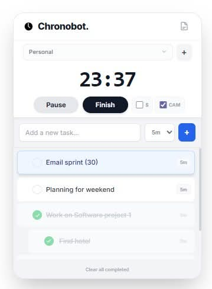
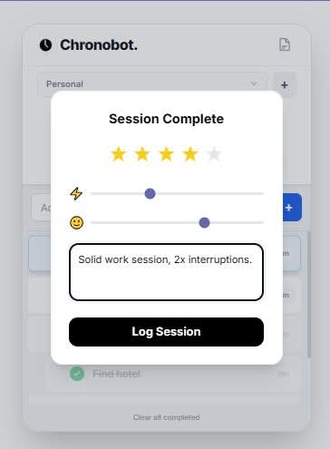

- 👋 Hi, I’m @jaybestnz
- 👀 I’m interested in python, php and scraping
- 🌱 I’m currently learning python
- 💞️ I’m looking to collaborate on data cleaning / data work
- 📫 How to reach me http://www.jaybest.nz

<!---
jaybestnz/jaybestnz is a ✨ special ✨ repository because its `README.md` (this file) appears on your GitHub profile.
You can click the Preview link to take a look at your changes.
--->

Chronobot_v1.0_Beta.zip

----------
#⏱ Chronobot v1.0.0 (Beta)
**The Quantified Self & Deep Work Tracker for Contractors**

**Version:** 0.1.0 (Alpha)
**Date:** 2026-01-15
**Developer:** Jay Best (jaybest.nz)
**License:** Free / Donation / As-Is (No Support Guaranteed)

About: 
This is a personal time tracker for quantified self, scientific research, or as a tool for tracking and billing hours.

----------

## 🧠 Why Chronobot? (The Science)
Chronobot isn't just a timesheet; it's a "Deep Work" engine designed around neurological principles of focus and accountability.

* **Pomodoro Surges:** Humans are not wired for 8-hour marathons. We work best in 25-minute "sprints" of intense focus followed by recovery.
* **The Hawthorne Effect:** We behave differently when we are watched. Chronobot acts as a benevolent observer (screenshots & webcam), creating a psychological "container" that discourages doom-scrolling.
* **Cognitive Load Reduction:** By forcing you to list small, actionable tasks, we reduce the "Switching Cost" of deciding what to do next.
* **Fatigue Metrics:** We track your keystroke error ratio (Backspace/Delete usage). A spike in errors is a biological signal: *Your brain is tired. Take a break.*

---

## 🛡️ Privacy & Security (Crucial Read)
Chronobot is **Local-First Software**.
* **Your Data:** Stored 100% on your hard drive (`work_data.db` and `/data_captures/`). Nothing is sent to the cloud.
* **Screenshots:** The app takes random screenshots of your desktop. **Warning:** This will capture *everything* on screen, including passwords, bank details, or private chats if they are visible.
* **Webcam:** Takes random snapshots of you working (optional toggle).
* **Keylogging:** Chronobot counts **Keystrokes Per Minute (KPM)** and **Error Keys** (Backspace/Delete). It does **NOT** record the content of what you type.
* **Evidence:** In a dispute, the generated report serves as a "Proof of Work" ledger, complete with visual evidence of activity during billed hours.

---

## 🚀 Features
* **Task Triage:** Organize your sprint. The top task is your "Active Focus."
* **Random Sampling:** Captures "Time in Motion" evidence randomly (10-30 min intervals).
* **Idle Detection:** Auto-pauses if you walk away for 5+ minutes.
* **Subjective Logging:** End-of-session survey tracks Energy (⚡), Mood (🙂), and Focus rating.
* **Financials:** Toggle "Billable" to calculate earnings based on hourly rates (+GST support).
* **Client Ready Reports:** Generate a clean HTML/PDF report. You can toggle off "Internal Metrics" and "Webcams" before sending to a client.

---

## 📷 Screenshots





---

## 📦 Installation

### Windows
1.  Unzip the folder.
2.  Double-click `chronobot.bat`.
3.  The app will launch in a clean App Window.

### Linux (Ubuntu/Debian)
1.  Open Terminal in the folder.
2.  Install dependencies:
    ```bash
    sudo apt install python3-pip python3-tk
    pip3 install Flask waitress mss opencv-python pynput
    ```
3.  Run: `python3 app.py`
4.  Open `http://localhost:5000` in your browser.

### Mac (macOS)
1.  Open Terminal in the folder.
2.  Install dependencies:
    ```bash
    pip3 install Flask waitress mss opencv-python pynput
    ```
3.  Run: `python3 app.py`
4.  **Permissions:** You must grant "Terminal" (or Python) permission to **Record Screen** and **Accessibility** in System Settings when prompted.

---

## 🔧 Troubleshooting
* **"Internal Server Error":** The database might be locked or incompatible. Close the window, check Task Manager for any stuck `python` processes, and end them.
* **Webcam not working:** Ensure no other app (Zoom/Teams) is using the camera. Chronobot grabs the first available device (Index 0).
* **No Sound:** Ensure your system volume is up. The sound is a subtle "Glass Ping" that plays when a session finishes.

---

## 🐛 Feature Requests & Bugs
This is a **Beta Release** provided "As-Is". I do not guarantee support or future updates.
However, you can log issues or suggestions on the **GitHub Issues** tab or the **itch.io** comment section.

**Known Issues / Upcoming Roadmap:**
* [ ] **Bug:** Switching the top task doesn't always trigger a "Focus Switch" log immediately.
* [ ] **Bug:** Clicking "Complete" hides tasks from the tray (Intended behavior for focus, but confusing for some).
* [ ] **Feature:** Package as a standalone `.exe` (No Python install needed).
* [ ] **Feature:** Bell sound might be too quiet on some systems.

---

**Made with 🤖 & ❤️ by [JayBest.nz](https://www.jaybest.nz)**
